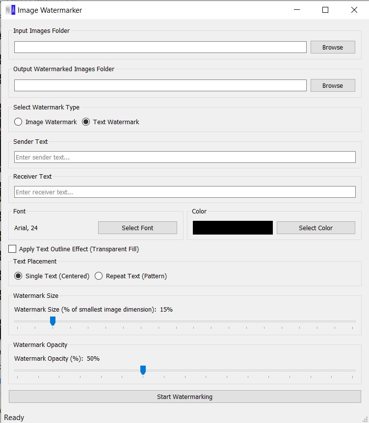

# Image Watermarker Application

This is a full-fledged Python application built with PyQt5 for watermarking images. It supports both image-based and text-based watermarks, offering control over size and transparency, and features a user-friendly graphical interface. The application processes images in a selected input folder and saves the watermarked versions to a specified output folder.

# Update
## 14th July'25
- Add option for hollow text
- Add option for single text watermark and Multi text watermark
- Sender and receiver name will work as watermark in case of text option

## Features
* **Object-Oriented Design (OOP):** The core image processing logic is encapsulated in the ImageWatermarker class, separate from the WatermarkApp GUI class, promoting modularity and reusability.

* **Two Watermark Types:**

    - Image Watermark: Use an existing image file (e.g., your logo) as a watermark.

    - Text Watermark: Apply custom text as a watermark, with options to select font and color.

        - Single line Text watermark with text outline option
        - Multiline Text watermark

* **Configurable Watermark Properties:**

    - **Size:** Adjust the watermark size as a percentage of the input image's smallest dimension.

    - **Opacity/Transparency:** Control the transparency level of the watermark (with a minimum of 20% visibility to ensure it's never fully transparent).

* **Repeating Watermarks:** The watermark (image or text) automatically repeats and tiles itself across larger images, ensuring full coverage even on high-resolution pictures.

* **Folder Selection:** Easy selection of input and output directories via file dialogs.

* **Non-Blocking GUI:** Image processing runs in a separate thread, keeping the user interface responsive during long operations.

* **Job Completion Notification:** A pop-up message confirms when the watermarking process is complete, including details on processed images and any errors.

* **Settings Persistence:** Remembers your last-used input/output folders, watermark settings (type, path/text, size, opacity, font, color), saving time on subsequent uses.

* **Window Icon/Logo:** Customizable application window icon for better branding (requires a icon.ico file).

* **Image Format Compatibility:** Handles input images with 1 (grayscale), 3 (RGB), and 4 (RGBA) color channels.

## Prerequisites
Before running the application, ensure you have Python installed (version 3.6 or higher is recommended).

Installation
This project requires the Pillow (PIL fork for image processing) and PyQt5 (for the GUI) libraries.

* **Clone or Download:** Get the project code (e.g., save the provided Python code into a file named image_watermarker.py).

* **Install Dependencies:** Open your terminal or command prompt and run the following command:

    ```bash
        pip install -r requirments.txt
    ```
Usage
* **Prepare your Logo (Optional but Recommended):** If you wish to have a custom application icon, place your logo image file (e.g., icon.ico) inside the icon directory as your **image_watermarker.py** script. The code is set to look for icon.ico by default.

* **Run the Application:** Navigate to the directory where you saved image_watermarker.py in your terminal and execute:

    ```bash
        python image_watermarker.py
    ```
___
# GUI instructions:



* **Select Folders:**

    Click **"Browse"** next to **"Input Images Folder"** to choose the directory containing the images you want to watermark.

    Click **"Browse"** next to **"Output Watermarked Images Folder"** to select where the processed images will be saved.

* **Choose Watermark Type and Configure:**
    Image Watermark: Select "Image Watermark" radio button. Then, click "Browse" next to "Watermark Image File" to select your watermark image (e.g., a .png logo with transparency).


* **Text Watermark:** Select "Text Watermark" radio button.
    Type your desired watermark text into the "Watermark Text" input box.
    
    Click "Select Font" to choose the font family and size for your text.

    Click "Select Color" to pick the color of your text watermark.


* **Adjust Settings:**

    Use the "Watermark Size" slider to control how large the watermark should be relative to the input images.

    Use the "Watermark Opacity" slider to set the transparency of the watermark. (Note: It cannot be fully transparent, minimum 20% visibility).

* **Start Watermarking:** Click the "Start Watermarking" button. The application will process all supported image files in the input folder and save them to the output folder. A status bar will show progress, and a pop-up will notify you upon completion.

### Note :
90% percent of code for this application is vibe coding using google gemini only 10% by human to fix small issue. 
**Enjoy watermarking your images with ease!** 

## LICENSE AND AUTHOR 
* **Apache 2.0**
* **Kuldeep Singh** | **Email** : shergillkuldeep@outlook.com
* For **Watermarker.exe** Feel free to contact.
