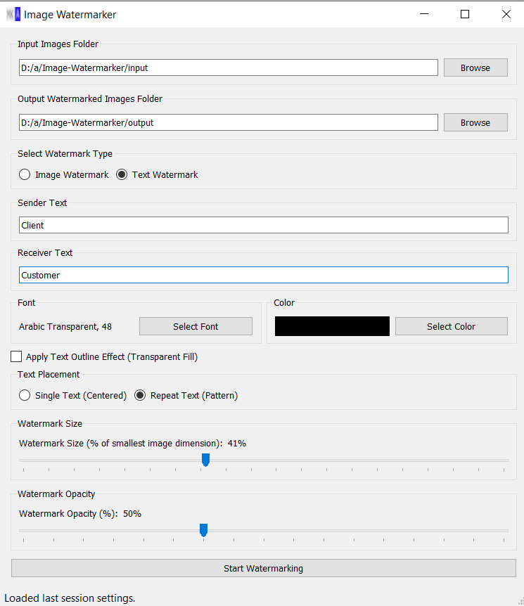

# Image Watermarker Application

This is a full-fledged Python application built with PyQt5 for watermarking images. It supports both image-based and text-based watermarks, offering control over size and transparency, and features a user-friendly graphical interface. The application processes images in a selected input folder and saves the watermarked versions to a specified folder.

# Instructions:



* **Select Folders:**

    Click **"Browse"** next to **"Input Images Folder"** to choose the directory containing the images you want to watermark.

    Click **"Browse"** next to **"Output Watermarked Images Folder"** to select where the processed images will be saved.

* **Choose Watermark Type and Configure:**
    - **Image Watermark:** Select "Image Watermark" radio button. Then, click "Browse" next to "Watermark Image File" to select your watermark image (e.g., a .png logo with transparency).
   - **Text Watermark:** Select "Text Watermark" radio button.
    Type your desired watermark text into the "Watermark Text" input box.
    
        Click "Select Font" to choose the font family and size for your text.

     Click "Select Color" to pick the color of your text watermark.

* **Utility Options :**
    - **Apply Text outline:** When enabled, the text watermark will only contain the outline.
    - **Single Text and Repeat Text:** Choose between a single centered watermark or a repeating pattern across the image.
    - **Add current date:** When checked, the current date (YYYY-MM-DD) will be added to the bottom-left of the image.

* **Settings & Start Watermarking :**

    - Use the "**Watermark Size**" slider to control how large the watermark should be relative to the input images.

    - Use the "**Watermark Opacity**" slider to set the transparency of the watermark. (Note: It cannot be fully transparent, minimum 20% visibility).

    - Click the "**Start Watermarking**" button. The application will process all supported image files in the input folder and save them to the output folder. A status bar will show progress, and a pop-up will notify you upon completion.

## Prerequisites
Before running the application, ensure you have Python installed (version 3.6 or higher is recommended).

* **Installation**
This project requires the Pillow (PIL fork for image processing) and PyQt5 (for the GUI) libraries.

* **Clone or Download:** Get the project code (e.g., save the provided Python code into a file named app.py).

* **Install Dependencies:** Open your terminal or command prompt and run the following command:

    ```bash
    pip install -r requirments.txt
    ```
Usage
* **Prepare your Logo (Optional but Recommended):** If you wish to have a custom application icon, place your logo image file (e.g., icon.ico) inside the icon directory.

* **Run the Application:** Navigate to the directory where you saved the files in your terminal and execute:

    ```bash
        python app.py
    ```
___

# Update
## 31st March'26
- Add "Add current date" checkbox to include current date on images.
- Optimize UI layout for better fit on various screen sizes.
- Clean up duplicate logic in watermarking engine.

## 14th July'25
- Add option for hollow text
- Add option for single text watermark and Multi text watermark
- Sender and receiver name will work as watermark in case of text option

## 12th Nov'25
- Fix RGBA pictures issue
- Update Readme file in better sensor.
- Change main file name to app. 

### Note :
60% percent of code for this application is vibe coding using google gemini only 40% by human to fix small issue. 
**Enjoy watermarking your images with ease!** 

## LICENSE AND AUTHOR 
* **Apache 2.0**
* **Kuldeep Singh** | **Email** : shergillkuldeep@outlook.com
* For **Watermarker.exe** Feel free to contact.
